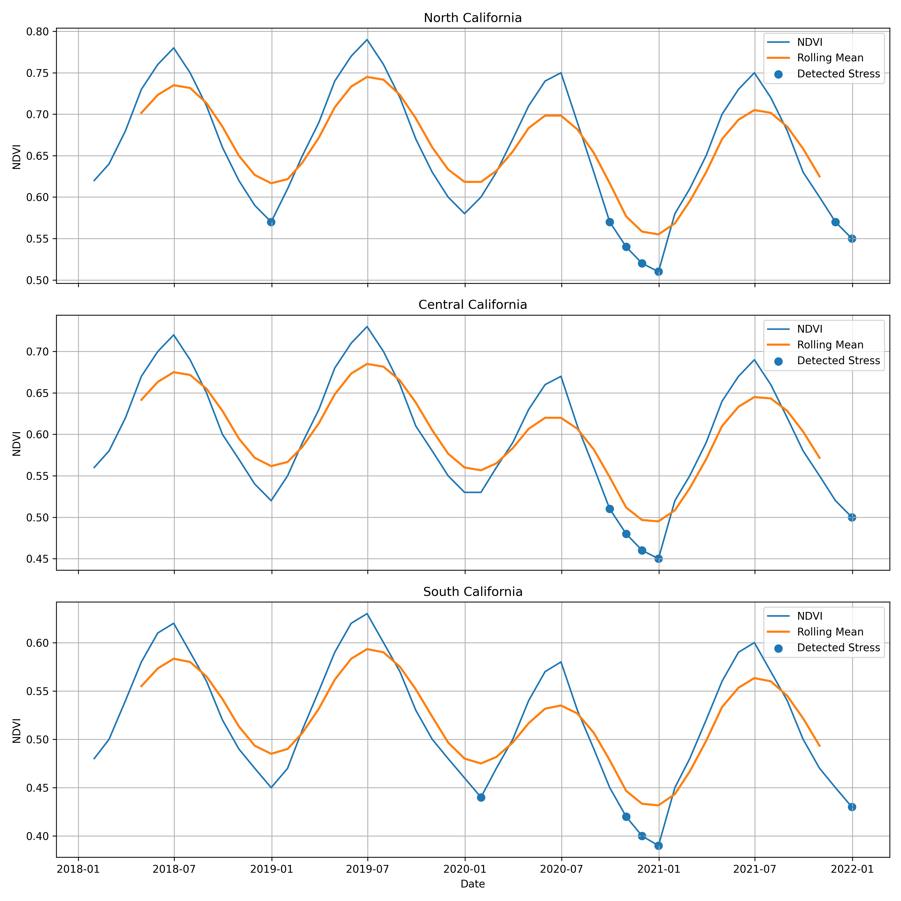
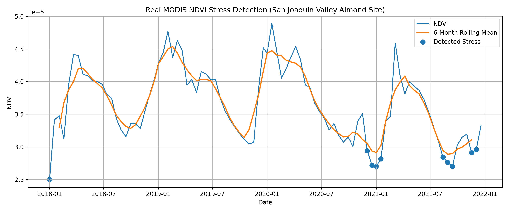
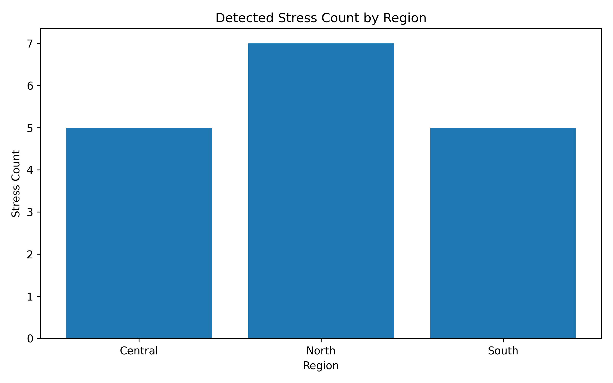

# California Multi-Temporal Remote Sensing Change Detection for Vegetation Stress Monitoring

This project explores multi-temporal vegetation changes in California using environmental time series analysis.  
The goal is to detect abnormal vegetation stress periods and compare vegetation dynamics across regions.

## Project Stages

### Stage 1: Simulated NDVI Prototype
A simulated NDVI time series was created to validate the workflow for:
- trend visualization
- rolling mean smoothing
- z-score anomaly detection

### Stage 2: CSV-Based File Input
The same workflow was applied to NDVI data loaded from CSV files.

### Stage 3: Reusable Functions
The analysis was modularized into reusable functions for:
- loading data
- computing rolling means and z-scores
- plotting and saving vegetation stress results

### Stage 4: Multi-Region Comparison
A multi-region California dataset was analyzed to compare:
- average NDVI levels
- minimum and maximum NDVI
- detected vegetation stress counts

### Stage 5: Real MODIS Remote Sensing Data
The workflow was extended to a real MODIS NDVI time series from a California site.  
This stage demonstrates that the prototype can be applied to real remote sensing vegetation data rather than only simulated or manually prepared datasets.

## Tech Stack

- Python
- Jupyter Notebook
- pandas
- numpy
- matplotlib

## Key Findings

- North California shows the highest average NDVI baseline in the regional comparison.
- South California shows the lowest vegetation baseline and lowest minimum NDVI.
- Stress periods are detected in all three California regions.
- A real MODIS NDVI time series can be successfully integrated into the same workflow.
- The workflow is transferable from prototype examples to real remote sensing applications.

## Example Figures

### Multi-Region Stress Detection


### Real MODIS NDVI Stress Detection


### Stress Count by Region


## Project Structure

```text
california-vegetation-change-detection/
├── notebooks/
│   └── vegetation_change_detection.ipynb
├── data/
├── figures/
├── README.md
├── requirements.txt
└── .gitignore

## How to Reproduce

1. Clone this repository
2. Install dependencies
3. Open the notebook in Jupyter Notebook or VS Code
4. Run all cells

```bash
git clone https://github.com/l1nyue666/california-vegetation-change-detection.git
cd california-vegetation-change-detection
pip3 install -r requirements.txt